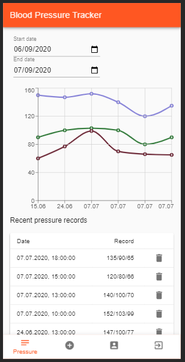

# Blood pressure tracker 

Demo Progressive Web Application (PWA) for tracking blood pressure statistics. 
Client side is based on React and Material UI [/client], server side on ExpressJS and cloud functions [/functions]. Application is hosted on Google Firebase (https://firebase.google.com/) and uses it`s convenient features for development simplicity.
Inspired from this article: https://www.freecodecamp.org/news/how-to-build-a-todo-application-using-reactjs-and-firebase/

URL: https://blood-pressure-tracker-77c8c.web.app/

**Main features:**

- Sign up, sign in, sign out (Firebase Authentification).
- Add, view and delete blood pressure records (Firebase Functions for API and NoSQL Database).
- Pressure statistics and graphs for any period of time.
- Push notifications for reminding to track a pressure (planned).
- Offline mode (planned).

## Useful commands

### Firebase
`firebase login --reauth`

`firebase serve`

`firebase deploy`
